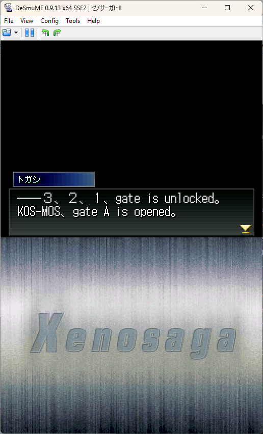
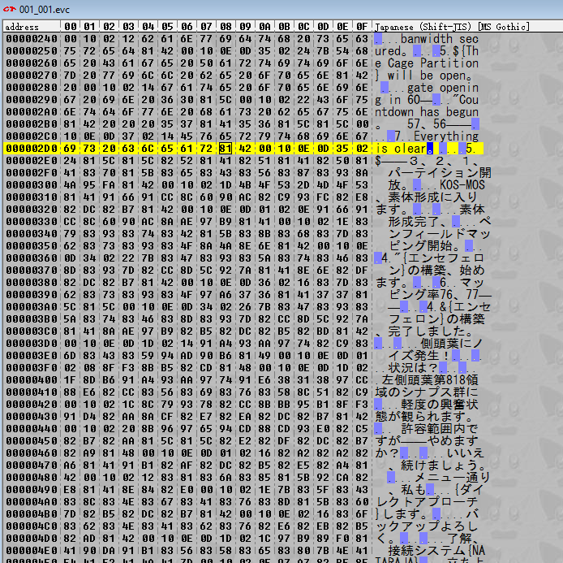
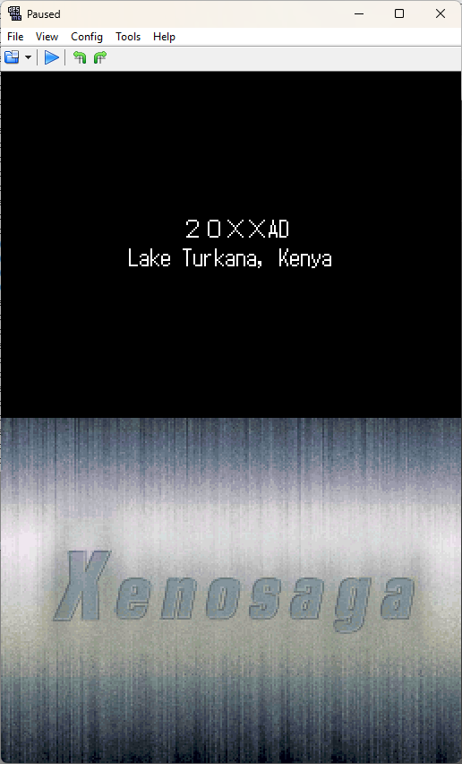
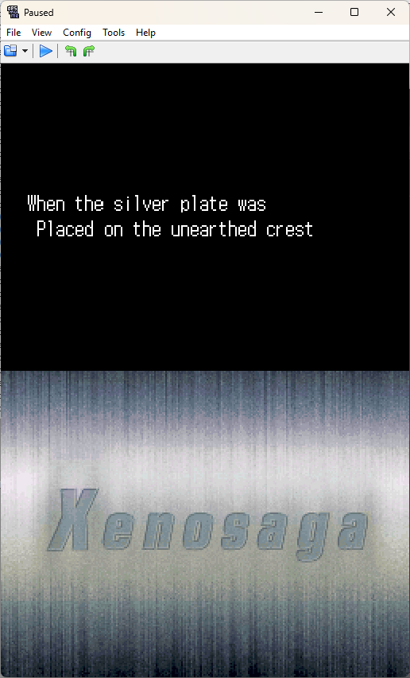

# Xenosaga_DS_Project
The most ambitious project I've ever attempted

## This is a passion project of mine:
If you come across this, please keep in mind that I am learning as I go and this read me will be kept as a log of sorts of what I am working on.

## List of story files: /data/0/maptool

- [x] 000_001.evc 
- [ ] 000_500.evc 
- [ ] 000_501.evc 
- [x] 000_999.evc 
- [ ] 001_000.evc 
- [x] 001_001.evc 
- [x] 001_010.evc 
- [ ] 001_020.evc (WIP)
- [ ] 001_030.evc 
- [ ] 001_040.evc 
- [ ] 001_050.evc 
- [ ] 001_100.evc 
- [ ] 001_101.evc 
- [ ] 001_300.evc 
- [ ] 001_501.evc 
- [ ] 001_997.evc 
- [ ] 001_998.evc 
- [ ] 001_999.evc 
- [ ] 002_001.evc 
- [ ] 002_002.evc 
- [ ] 002_004.evc 
- [ ] 002_005.evc 
- [ ] 002_006.evc 
- [ ] 002_007.evc 
- [ ] 002_008.evc 
- [ ] 002_009.evc 
- [ ] 002_010.evc 
- [ ] 002_011.evc 
- [ ] 002_012.evc 
- [ ] 002_020.evc 
- [ ] 003_001.evc 
- [ ] 003_002.evc 
- [ ] 004_030.evc 
- [ ] 004_999.evc 
- [ ] 005_000.evc 
- [ ] 005_001.evc 
- [ ] 005_002.evc 
- [ ] 005_003.evc 
- [ ] 005_004.evc 
- [ ] 005_005.evc 
- [ ] 005_006.evc 
- [ ] 005_010.evc 
- [ ] 005_030.evc 
- [ ] 005_040.evc 
- [ ] 005_993.evc 
- [ ] 005_994.evc 
- [ ] 005_995.evc 
- [ ] 005_996.evc 
- [ ] 005_997.evc 
- [ ] 005_998.evc 
- [ ] 005_999.evc 
- [ ] 007_001.evc 
- [ ] 007_030.evc 
- [ ] 008_000.evc 
- [ ] 008_001.evc 
- [ ] 008_002.evc 
- [ ] 008_003.evc 
- [ ] 008_004.evc 
- [ ] 008_005.evc 
- [ ] 008_030.evc 
- [ ] 008_031.evc 
- [ ] 008_999.evc 
- [ ] 009_000.evc 
- [ ] 009_001.evc 
- [ ] 009_002.evc 
- [ ] 009_003.evc 
- [ ] 009_004.evc 
- [ ] 009_010.evc 
- [ ] 009_011.evc 
- [ ] 009_030.evc 
- [ ] 009_031.evc 
- [ ] 009_033.evc 
- [ ] 009_034.evc 
- [ ] 009_035.evc 
- [ ] 009_040.evc 
- [ ] 009_041.evc 
- [ ] 009_100.evc 
- [ ] 009_300.evc 
- [ ] 009_996.evc 
- [ ] 009_997.evc 
- [ ] 009_998.evc 
- [ ] 009_999.evc 
- [ ] 010_000.evc 
- [ ] 010_001.evc 
- [ ] 010_002.evc 
- [ ] 010_003.evc 
- [ ] 010_004.evc 
- [ ] 010_005.evc 
- [ ] 010_010.evc 
- [ ] 010_030.evc 
- [ ] 010_031.evc 
- [ ] 010_032.evc 
- [ ] 010_033.evc 
- [ ] 010_100.evc 
- [ ] 010_300.evc 
- [ ] 010_998.evc 
- [ ] 010_999.evc 
- [ ] 011_000.evc 
- [ ] 011_001.evc 
- [ ] 011_002.evc 
- [ ] 011_030.evc 
- [ ] 011_031.evc 
- [ ] 011_032.evc 
- [ ] 011_033.evc 
- [ ] 011_040.evc 
- [ ] 011_998.evc 
- [ ] 011_999.evc 
- [ ] 012_000.evc 
- [ ] 012_001.evc 
- [ ] 012_002.evc 
- [ ] 012_010.evc 
- [ ] 012_020.evc 
- [ ] 012_030.evc 
- [ ] 012_031.evc 
- [ ] 012_032.evc 
- [ ] 012_040.evc 
- [ ] 012_041.evc 
- [ ] 012_100.evc 
- [ ] 012_998.evc 
- [ ] 012_999.evc 
- [ ] 013_000.evc 
- [ ] 013_030.evc 
- [ ] 013_040.evc 
- [ ] 013_041.evc 
- [ ] 014_000.evc 
- [ ] 014_030.evc 
- [ ] 014_040.evc 
- [ ] 014_041.evc 
- [ ] 014_100.evc 
- [ ] 015_000.evc 
- [ ] 015_001.evc 
- [ ] 015_030.evc 
- [ ] 016_000.evc 
- [ ] 016_001.evc 
- [ ] 016_002.evc 
- [ ] 016_003.evc 
- [ ] 016_004.evc
- [ ] 016_005.evc
- [ ] 016_006.evc
- [ ] 016_007.evc
- [ ] 016_010.evc
- [ ] 016_020.evc
- [ ] 016_021.evc
- [ ] 016_030.evc
- [ ] 016_031.evc
- [ ] 016_050.evc
- [ ] 016_052.evc
- [ ] 016_053.evc
- [ ] 016_054.evc
- [ ] 016_055.evc
- [ ] 016_056.evc
- [ ] 016_057.evc
- [ ] 016_900.evc
- [ ] 016_901.evc
- [ ] 016_989.evc
- [ ] 016_990.evc
- [ ] 016_991.evc
- [ ] 016_992.evc
- [ ] 016_993.evc
- [ ] 016_994.evc
- [ ] 016_995.evc
- [ ] 016_996.evc
- [ ] 016_997.evc
- [ ] 016_998.evc
- [ ] 016_999.evc
- [ ] battleend.evc 
- [ ] battletest.evc
- [ ] card.bdy 
- [ ] encount.evc
- [ ] fadeinonly.evc
- [ ] mail.bdy

## List of story files: /data/1/evc

- [x] 001.evc
- [x] 003.evc
- [x] 004.evc
- [ ] 006.evc
- [ ] 011.evc
- [ ] 012.evc
- [ ] 015.evc
- [ ] 017.evc
- [ ] 018.evc
- [ ] 019.evc
- [ ] 020.evc
- [ ] 021.evc
- [ ] 022.evc
- [ ] 024.evc
- [ ] 025.evc
- [ ] 026.evc
- [ ] 030.evc
- [x] battletest.evc (NO INFO)
- [x] btltutorial0.evc
- [x] btltutorial1.evc
- [x] btltutorial2.evc
- [x] btltutorial3.evc

## 1/26/2026
I haven't updated in a bit I have been working through it all of it still. I started the checklist, that's not all the files just a good amount so I can keep track of how long this will take.

## 1/15/2026

After doing the initial opening sequence I found the dialouge that follows. The main part has started with trying to get translations text to fit in the space that has been provided, wihch seems to be hard on it's own. Crashed the game a few times, But I am getting the hang of it. Adding screenshots of the translations and what I'm working with.

## 1/14/2026

I've made some headway as far as changing some things, the formatting is not where I want it to be, but honestly I'm proud of it so far. I decided to remove the files from the repo since it's not that interesting and there are a lot of files. A LOT and it didn't upload some of them because of limitations. I mainly wanted to have everything on the repo so it would be better management and I could work on it easily from different devices. Since that seems to be a bust I'm doing it semi-old school by having it all on a flash drive. 

I finished the first scene of just text.

## 1/13/2026
**So far I have not done much for the project, I unpacked the rom to see the internal files and poked around, the hard part**

**I made a small python program to search though the program so that I can find the script for the game so that I can start looking at it and translating, since there are a lot of files and honestly I don't know what I am doing. I found what some of the first parts of dialogue of the game.  
This is the start and I'm honestly feeling pretty hopeful.**

 - [ ] Find all (most) of the story text and transfer it to text docs
 - [ ] find the menu 

